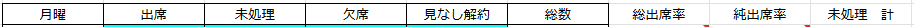

# プログラム説明書

## 関数定義

| 書式   | function setup()                 |
| :----- | :------------------------------- |
| 機能   | Config，Scriptシートを作成する． |
| 引数   | なし                             |
| 戻り値 | なし                             |


| 書式   | function createStatisticSheet() |
| :----- | :------------------------------ |
| 機能   | 集計用シートを作成する．        |
| 引数   | なし                            |
| 戻り値 | なし                            |


| 書式                | function backSum(int[] num, int flag)                                           |
| :------------------ | :------------------------------------------------------------------------------ |
| 機能                | リストnumを参照して，最後尾の要素からflagで指定される部分までの合計をを求める． |
| 引数int[] numの意味 | 班数に対応するリスト                                                            |
| 引数flagの意味      | リストnumの最後尾の要素から逆走して加算する際のループ脱出基準                   |
| 戻り値              | int sum：集計行から各実施場所までの差分行数                                     |

---

## 変数定義

- プログラム全体で共通の値

| 変数名                   | 説明                                            |
| :----------------------- | :---------------------------------------------- |
| var maxWidth             | Configシートの横項目読み取り最大数              |
| var makeStatisticsSheets | 出席率記入用シートを作成するか true/false       |
| var makeAggregateSheet   | 全体集計シート（グラフ）を作成するか true/false |
| var statisticClass       | 集計区分のプルダウンリスト項目設定              |

- 関数またはブロック内で共通の値  
setup()

| 変数名            | 説明                                                   |
| :---------------- | :----------------------------------------------------- |
| const ss          | Apps Scriptを開いたスプレッドシート全体                |
| let scriptSheet   | Scriptシート全体                                       |
| let configSheet   | Configシート全体                                       |
| let data1         | 列数のリスト（str [][]）                               |
| let in_data1      | data1を二次元リストにするために使用（str []）          |
| const data2       | Configシートの記入項目（str []）                       |
| let statisticRule | プルダウンリストの選択ルールをstatisticClassを基に作成 |

createStatisticSheet()

| 変数名                    | 説明                                                |
| :------------------------ | :-------------------------------------------------- |
| const ss                  | Apps Scriptを開いたスプレッドシート全体             |
| let configSheet           | Configシート全体                                    |
| let rowNum                | データを書き込む対象の行番号（int）                 |
| let data1                 | 実施回数に関する情報の元データ（str [][]）          |
| let data2                 | 時間帯に関する情報の元データ（str [][]）            |
| let data3                 | 実施場所に関する情報の元データ（str [][]）          |
| let data4                 | 班数に関する情報の元データ（str [][]）              |
| let data5                 | 集計分類に関する情報の元データ（str [][]）          |
| let data6                 | 集計区分に関する情報の元データ（str [][]）          |
| let part                  | 実施回数のリスト（str []）                          |
| let section               | 時間帯のリスト（str []）                            |
| let place                 | 実施場所のリスト（str []）                          |
| let group                 | 班数のリスト（str []）                              |
| let groupCount            | 班数のリスト（int []）                              |
| let statisticOption       | 集計分類のリスト（str []）                          |
| let statisticRule         | 集計区分のリスト（str []）                          |
| let attendsIndex          | 出席区分の行番号（int []）                          |
| let absentsIndex          | 欠席区分の行番号（int []）                          |
| let unattendsIndex        | 未処理区分の行番号（int []）                        |
| let ignoreIndex           | 集計除外区分の行番号（int []）                      |
| let linkLines             | 各時間帯の表の先頭行（int []）                      |
| let statisticLines        | 各時間帯の表の集計行（int []）                      |
| let halfSectionCount      | 上部集計行の折り返し推定（int）                     |
| let sheetExist            | 既存シートと名称が衝突しているかどうか数える（int） |
| let wantcontinue          | メッセージウィンドウからの応答（str）               |
| let checkSheet            | 既存シートが存在すれば取得                          |
| let baseSheet             | Baseシート全体                                      |
| let totalStartRowNum      | 1番目の時間帯の表の開始行（int）                    |
| let tableRowCount         | 各時間帯の表の行数（int）                           |
| let placeStatisticFormula | 各時間帯における場所の総集計行の計算式（str）       |
| let firstLineArray        | 各時間帯の表の先頭行の目次（str [][]）              |
| let attendsFormula        | 総出席率の計算式（str）                             |
| let ignoreFormula         | 純出席率の計算式（str）                             |
| let unattendsFormula      | 未処理者合計の計算式（str）                         |
| let baseColumn            | 各シート上部の集計部の基準列（int）                 |
| let rowCount              | 各シート上部の集計部の行カウント（int）             |
| let basegid               | Baseシートのgid，リンクの作成に使用（str）          |
| let completedsheet        | 複製したシートのまとめリスト                        |
| let finalSheet            | 複製したシート                                      |
| let finalgid              | 複製したシートのgid（str）                          |
| let statisticSheet        | 全体集計用シート                                    |
| let sectionCol            | 時間帯のリスト（str []）                            |
| let graphRange            | 描画するグラフ用のデータ（int []）                  |
| let graph                 | 描画するグラフ                                      |

backSum()

| 変数名  | 説明        |
| :------ | :---------- |
| let sum | 合計（int） |

---

## コードの説明（一部）

```js
// 集計区分のプルダウンリスト項目設定
var statisticClass = ['出席', '欠席', '未処理', '集計除外'];
```

プルダウンリストで選択する要素を増やしたい場合は，このリストを拡張する．

```js
    // 総出席率計算式
    let attendsFormula = '=(';
    for (let j = 0; j < attendsIndex.length; j++) {
      attendsFormula += 'RC[' + (-2 - statisticOption.length + attendsIndex[j]) + ']';
      if (j + 1 !== attendsIndex.length) attendsFormula += '+';
    }
    attendsFormula += ')/RC[-1]';

    // 純出席率計算式
    let ignoreFormula = '=(';
    for (let j = 0; j < attendsIndex.length; j++) {
      ignoreFormula += 'RC[' + (-3 - statisticOption.length + attendsIndex[j]) + ']';
      if (j + 1 !== attendsIndex.length) ignoreFormula += '+';
    }
    ignoreFormula += ')/(RC[-2]';
    for (let j = 0; j < ignoreIndex.length; j++) {
      ignoreFormula += '-';
      ignoreFormula += 'RC[' + (-3 - statisticOption.length + ignoreIndex[j]) + ']';
    }
    ignoreFormula += ')';

    // 未処理者 計 計算式
    let unattendsFormula = '=';
    for (let j = 0; j < unattendsIndex.length; j++) {
      unattendsFormula += 'RC[' + (-4 - statisticOption.length + unattendsIndex[j]) + ']';
      if (j + 1 !== unattendsIndex.length) unattendsFormula += '+';
    }
```

計算式ではR1C1形式を用いて相対的に記述している．欠席者の合計など新たに集計したい要素が増えた場合は，この部分に計算式の処理を加筆し，セルに書き込めば良い．

---

## 表の作成

このプログラムでは1つ表を作成した後，複製を繰り返して表を増やしていく．  
ここで，1つ表を作成する処理をブロックに分けて説明する．


### 1行目の作成

```js
baseSheet.getRange(totalStartRowNum, 2, 1, firstLineArray[0].length).setValues(firstLineArray).setHorizontalAlignment('center');
```
`getRange()`でデータを書き込むセルを取得し，`setValues()`でデータを書き込む．そして，`setHorizontalAlignment('center')`で中央揃えにする．


### 各実施場所の作成

```js
    for (let j = 0; j < place.length; j++) { // 実施場所毎のループ（1つの表）
      baseSheet.getRange(totalStartRowNum + tableRowCount, 3, groupCount[j], statisticOption.length).setBackground('aqua'); // 色をつける
      for (let k = 0; k < groupCount[j]; k++) { // 実施場所入力行生成部
        baseSheet.getRange(totalStartRowNum + tableRowCount, 2, 1, 1).setValue(place[j] + (k + 1) + '班').setHorizontalAlignment('center');
        baseSheet.getRange(totalStartRowNum + tableRowCount, 3 + statisticOption.length, 1, 1).setFormulaR1C1('=SUM(RC[' + (-statisticOption.length) + ']:RC[-1])');
        tableRowCount++;
      }
      baseSheet.getRange(totalStartRowNum + tableRowCount, 2, 1, 1).setValue(place[j] + '合計').setHorizontalAlignment('center'); // 実施場所毎合計部
      baseSheet.getRange(totalStartRowNum + tableRowCount, 3, 1, statisticOption.length).setFormulaR1C1('=SUM(R[' + (-groupCount[j]) + ']C:R[-1]C)');
      baseSheet.getRange(totalStartRowNum + tableRowCount, statisticOption.length + 3, 1, 1).setFormulaR1C1('=SUM(RC[' + (-statisticOption.length) + ']:RC[-1])'); // 時間帯の1場所の合計
      baseSheet.getRange(totalStartRowNum + tableRowCount, statisticOption.length + 4, 1, 1).setFormulaR1C1(attendsFormula).setNumberFormat("0%"); // 時間帯の1場所の総出席率
      baseSheet.getRange(totalStartRowNum + tableRowCount, statisticOption.length + 5, 1, 1).setFormulaR1C1(ignoreFormula).setNumberFormat("0%"); // 時間帯の1場所の純出席率
      baseSheet.getRange(totalStartRowNum + tableRowCount, statisticOption.length + 6, 1, 1).setFormulaR1C1(unattendsFormula); // 時間帯の1場所の未処理 計
      tableRowCount++;
    }
```
`j`によるループは実施場所のループ，`k`によるループは班数のループである．`setBackground('aqua')`でセルを水色に塗りつぶす．`setFormulaR1C1()`でセルに計算式を書き込む．各Formulaは相対セルを指定可能なR1C1形式で作成されている．`setNumberFormat("0%")`で小数点以下0桁の%書式を設定する．


### 各時間帯における場所の総集計行の作成

```js
// 合計計算（相対仕様に変更）
    baseSheet.getRange(totalStartRowNum + tableRowCount, 2, 1, 1).setValue('合計').setFontColor('red').setHorizontalAlignment('center');
    for (let j = place.length - 1; j >= 0; j--) {
      let back = 0;
      if (j === place.length - 1) back = -1;
      else
        back = -backSum(groupCount, j + 1) - (place.length - j);
      placeStatisticFormula += 'R[' + back + ']C';
      if (j !== 0) placeStatisticFormula += '+';
    }
    baseSheet.getRange(totalStartRowNum + tableRowCount, 3, 1, statisticOption.length).setFormulaR1C1(placeStatisticFormula); // 要素ごとの最終合計
    baseSheet.getRange(totalStartRowNum + tableRowCount, statisticOption.length + 3, 1, 1).setFormulaR1C1('=SUM(RC[' + (-statisticOption.length) + ']:RC[-1])'); // 時間帯の合計
    baseSheet.getRange(totalStartRowNum + tableRowCount, statisticOption.length + 4, 1, 1).setFormulaR1C1(attendsFormula).setNumberFormat("0%"); // 時間帯の総出席率
    baseSheet.getRange(totalStartRowNum + tableRowCount, statisticOption.length + 5, 1, 1).setFormulaR1C1(ignoreFormula).setNumberFormat("0%"); // 時間帯の純出席率
    baseSheet.getRange(totalStartRowNum + tableRowCount, statisticOption.length + 6, 1, 1).setFormulaR1C1(unattendsFormula); // 時間帯の未処理 計

```

`backSum()`を用いながら，各時間帯における場所の総集計行のR1C1形式計算式を作成し，セルに書き込む．


```js
baseSheet.getRange(totalStartRowNum, 2, tableRowCount, statisticOption.length + 2).setBorder(true, true, true, true, true, true); // 枠線を引く
```

補足だが，`setBorder()`で枠線をつける．
